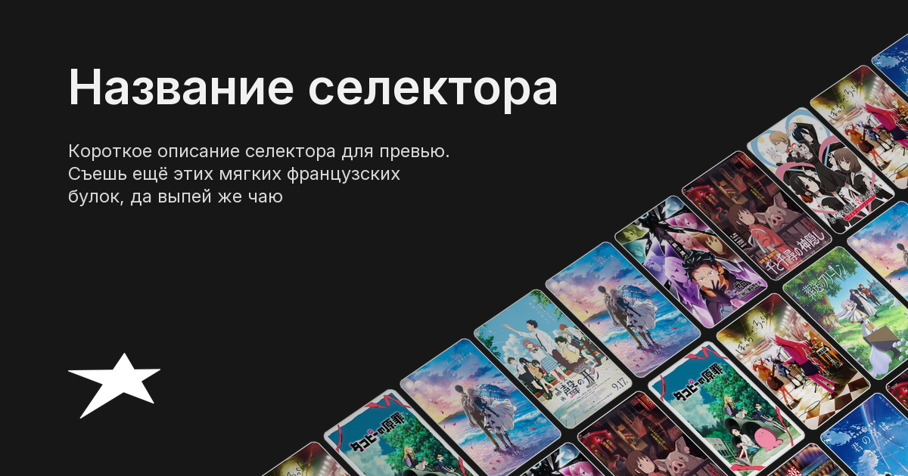

# MetaPreview

Генератор OG-превью (1200×630) для селекторов и релизов. Собирает карточку из текста, логотипа и сетки постеров с перспективой.

## Режимы

| Режим | Статус | Описание |
|-------|--------|----------|
| `PreviewMode.SELECTOR` | готов | Название, описание, лого, сетка постеров справа |
| `PreviewMode.RELEASE` | в планах | — |

### Пример: Selector



## Установка

```bash
python -m venv .venv
.venv\Scripts\activate   # Windows
pip install -r requirements.txt
```

## Использование

```python
from meta_preview import PreviewMode, generate_preview

image = generate_preview(
    PreviewMode.SELECTOR,
    name="Название селектора",
    description="Короткое описание…",
    posters=["https://…/poster1.jpeg", "https://…/poster2.jpeg"],
    poster_source="network",  # или "local" — пути к файлам
)
image.save("output.png")
```

Тестовый запуск (сохраняет пример в `sources/selector_preview.png`):

```bash
python meta_preview.py
```

Отдельно — только сетка постеров с перспективой:

```bash
python selector_cards.py
```

## Структура

| Файл / папка | Назначение |
|--------------|------------|
| `meta_preview.py` | Сборка итоговой карточки |
| `selector_cards.py` | Сетка постеров, перспектива, маска прозрачности |
| `sources/` | Шрифты, лого (`logo.svg`), пример превью |
| `dev_posters/` | Локальные постеры для `poster_source="local"` |
| `opacity_mask.png` | Градиент прозрачности для сетки постеров |

### `sources/`

- `Inter_18pt-SemiBold.ttf`, `Inter_18pt-Regular.ttf` — шрифты
- `logo.svg` — логотип (122×87, белый)
- `selector_preview.png` — пример карточки Selector

## Зависимости

- [Pillow](https://python-pillow.org/) — рендер и композиция
- [requests](https://requests.readthedocs.io/) — загрузка постеров по URL
- [PyMuPDF](https://pymupdf.readthedocs.io/) — рендер SVG-лого
